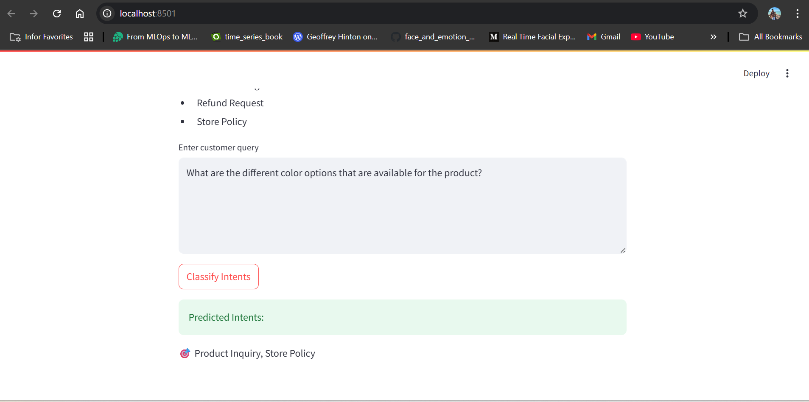

# 🧠 Customer-Support-Chatbot
Multi-Intent Classification for Customer Support Chatbot using pretrained BERT model.

Created a model that can classify a given customer query into one or more intents from the following categories:

Product Inquiry - Queries related to product details (e.g., features, pricing, availability).

Order Tracking - Queries related to tracking orders (e.g., "Where is my order?").

Refund Request - Queries related to requesting a refund (e.g., "How do I return this product?").

Store Policy - Queries related to the store’s policies (e.g., return policies, delivery times).

## 🚀 Features

- Powered by BERT – powerful and efficient model
- Packaged using **Docker** for easy deployment  

---

## 🛠️ Requirements

- ✅ pytorch –  
- ✅ transformers – 
- ✅ Docker Desktop – to containerize and run the chatbot  
- ✅ Python 3.10+ and pip 

# 🐳 Docker Setup
### Step 3: Build Docker Image
Ensure Docker Desktop is installed and running. Then build your image:

```
docker build -t my-chatbot:one .
```
### Step 4: Run the Docker Container

```
docker run -p 8501:8501 my-chatbot:one
```
---
# 🌐 Access Your Chatbot

- Open your browser and visit:

<url>http://localhost:8501</url>

- You should see the chatbot interface:



# 🧩 Project Structure (Example)
```
📦artifacts
 ┣ 📂model
 ┃ ┣ 📂bert_tokenizer
 ┃ ┃ ┣ 📜special_tokens_map.json
 ┃ ┃ ┣ 📜tokenizer_config.json
 ┃ ┃ ┗ 📜vocab.txt
 ┃ ┣ 📜bert_multilabel_model.pth
 ┃ ┗ 📜labels.pkl
 ┗ 📂processed
 ┃ ┗ 📜synthetic_intents.csv
📦config
 ┣ 📜paths_config.py
 ┗ 📜__init__.py
📦src
 ┣ 📜custom_model.py
 ┣ 📜features.py
 ┣ 📜inference.py
 ┣ 📜train.py
 ┗ 📜__init__.py
 📜.gitignore
 📜app.py
 📜Dockerfile
 📜README.md
 📜requirements.txt
 📜LICENSE

```
---